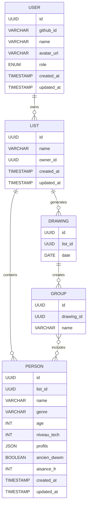
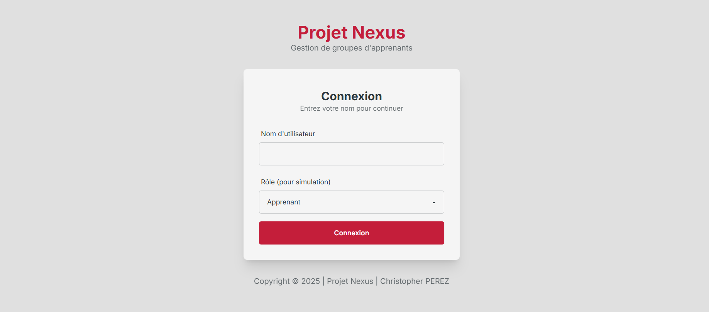

# :calendar: Projet Nexus | Partie 1

Une SPA **Angular** animée, en **TypeScript**, qui permet de gérer des listes d’apprenants, créer des groupes selon des critères, et ajuster manuellement les tirages, le tout simulant la persistance en **LocalStorage**.

Projet développé par [Christopher PEREZ](https://github.com/Chr1stopherPerez), durant ma formation à [SIMPLON](https://www.simplon.co/).

## Fonctionnalités

- **Listes**

  - Création, renommage et suppression de listes
  - Synthèse du nombre de personnes et de tirages par liste

- **Personnes**

  - Ajout, modification et suppression de personnes
  - Informations : nom, genre, âge, niveau technique, profils, ancien DWWM, aisance en français

- **Groupes**

  - Génération aléatoire de groupes équilibrés selon critères (âge, ancienneté, niveau, profils)
  - Ajustement manuel via drag-and-drop
  - Verrouillage et historique des tirages

- **Dashboards**

  - **Admin** : gestion des utilisateurs et métriques globales
  - **Formateur** : création et suivi des listes et tirages
  - **Apprenant** : consultation de ses affectations et historique

- **Persistance**
  - Simulation avec `localStorage` (avant migration backend)

## Technologies

- **Frontend** : Angular (v15+), TypeScript
- **Style** : Tailwind CSS + DaisyUI
- **Icônes** : Lucide Angular
- **Gestion de paquets** : pnpm
- **Tests** :
  - Unitaires : Vitest (`pnpm run test:unit`)
  - End-to-end : Cypress (`pnpm run test:e2e`)
- **CI/CD** : GitHub Actions (`.github/workflows/front-ci.yml`)

## Structure du projet

```text
Projet_Nexus/
├─ docs/
│   ├─ brief.v1.md
│   ├─ cahier_des_charges.md
│   ├─ Charte_Graphique_Projet_Nexus.pdf
│   └─ MCD_Projet_Nexus.pdf
├─ frontend/
│   ├─ src/
│   │   ├─ app/
│   │   │   ├─ core/
│   │   │   ├─ features/
│   │   │   ├─ shared/
│   │   │   ├─ layouts/
│   │   │   ├─ pages/
│   │   │   ├─ guards/
│   │   │   └─ interceptors/
│   │   ├─ assets/
│   │   └─ styles/
│   └─ e2e/
├─ .github/
│   └─ workflows/
│       └─ front-ci.yml
├─ tailwind.config.js
├─ angular.json
├─ pnpm-lock.yaml
└─ README.md
```

## Installation et Lancement

1. **Cloner le dépôt**

   ```bash
   git clone https://github.com/Chr1stopherPerez/Projet_Nexus.git
   cd Projet_Nexus
   ```

2. **Installer les dépendances**

   ```bash
   pnpm install --frozen-lockfile
   ```

3. **Lancer le serveur de développement**

   ```bash
   pnpm start
   ```

4. **Ouvrir**
   Rendez-vous sur `http://localhost:4200`

## Modèle Conceptuel de Données (MCD)



## Tests

- **Unitaires** :
  ```bash
  pnpm run test:unit
  ```
- **E2E** :
  ```bash
  pnpm run test:e2e
  ```

## Commandes

- **Lint** : Vérifier le code avec ESLint
  ```bash
  pnpm run lint
  ```

- **Tests unitaires** : Exécuter les tests avec Vitest
  ```bash
  pnpm run test
  ```

- **Tests avec couverture** : Exécuter les tests avec rapport de couverture
  ```bash
  pnpm run test:coverage
  ```

- **Tests E2E** : Exécuter les tests Cypress
  ```bash
  pnpm run cypress:open  # Interface graphique
  pnpm run cypress:run   # Mode headless
  ```

- **Build** : Compiler l'application pour la production
  ```bash
  pnpm run build
  ```

## CI/CD

Le workflow **front-ci.yml** exécute :

1. `pnpm install --frozen-lockfile`
2. `pnpm run lint`
3. `pnpm run test`
4. `pnpm run build --configuration production`
5. Publication sur GitHub Pages via `peaceiris/actions-gh-pages`

## Déploiement

L'application est déployée automatiquement sur GitHub Pages à chaque push sur la branche main :
[https://chr1stopherperez.github.io/Projet_Nexus/](https://chr1stopherperez.github.io/Projet_Nexus/)

## Captures d'Écran


